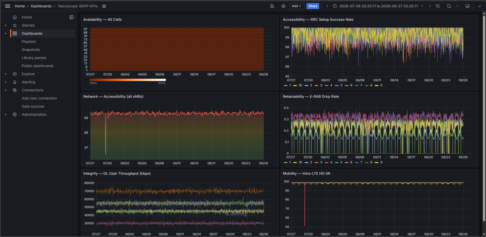

# telcoscope

> Modern data engineering (dbt, TimescaleDB, GitHub Actions) applied to
> mobile-network operations. **telcoscope** ingests vendor-native PM/FM/CM
> telemetry, transforms it via dbt into vendor-agnostic 3GPP KPI marts, and
> produces LLM-narrated root-cause hypotheses — all runnable locally in five
> minutes.

[](https://github.com/Tsunamimor/telcoscope/actions/workflows/ci.yml)
[](https://www.python.org/downloads/)
[](LICENSE)



---

## Why this exists

I've spent 25 years in mobile networks — most recently on 5G RAN and O-RAN
programmes across Nordic and European operators — and have watched operations
teams routinely spend hours root-causing cell-impacting degradations. Some
show up as vendor-specific alarms; others as gradual KPI trends across
counters that mean different things depending on who supplied the equipment.
Every new vendor introduction is another cycle of rebuilding the same KPIs
from scratch.

I've been extending my data engineering toolkit alongside that work — R via
Johns Hopkins and Python via IBM specialisations — and wanted a project that
applied modern data-stack practice to the domain I know best. **telcoscope**
is the result.

The project ingests Performance Management (PM), Fault Management (FM), and
Configuration Management (CM) data into a vendor-agnostic long-format schema,
transforms it via dbt into wide analytical marts covering the five 3GPP KPI
families (Accessibility, Retainability, Mobility, Integrity, Availability),
detects anomalies against ground-truth-labelled synthetic data, and produces
Anthropic Claude-narrated root-cause hypotheses correlated with concurrent
alarms and recent configuration changes. Everything runs locally via Docker
Compose; CI runs the full pipeline on every push.

**Current state (Week 2 complete):** vendor-agnostic ingestion, TimescaleDB
storage, dbt KPI marts with source-freshness and data-contract tests,
Grafana dashboards as code, all green in GitHub Actions.

**Next:** anomaly detection (statistical baselines + Isolation Forest,
evaluated honestly against the injection-planned ground truth), then
rule-based root-cause analysis, then LLM narration via the Anthropic API.

**Deliberately not:** a production replacement for Tier 1 operator analytics.
Real operator scale is orders of magnitude larger, and OSS/BSS integrations
aren't modelled. This is a *reference implementation* of the patterns —
small enough to run on a laptop, production-shaped enough to demonstrate
current best practice.

---

<sub>Built by [Paddy McPhillips](https://www.linkedin.com/in/paddymcphillips) —
Over 25 years in mobile-network engineering, currently expanding my data engineering and analytics expertise.</sub>

## Architecture at a glance

<!-- TODO: insert architecture diagram from docs/images/architecture.png -->

```
PM/FM/CM data  →  Raw (long format)  →  dbt marts (3GPP KPIs)  →  Detection
                                                                      ↓
              ←  Alert + LLM narrative  ←  RCA engine (rules + correlation)
```

See [`docs/ARCHITECTURE.md`](docs/ARCHITECTURE.md) for the full picture and
[`docs/ARCHITECTURE_EVOLUTION.md`](docs/ARCHITECTURE_EVOLUTION.md) for why the
data model looks the way it does.

## Quickstart

Requires Docker, Docker Compose, and `make`. Tested on macOS, Linux, and WSL2.

```bash
git clone https://github.com/Tsunamimor/telcoscope.git
cd telcoscope
cp .env.example .env       # adjust if you want; defaults work
make up                    # brings up Postgres+TimescaleDB, Grafana, Adminer
make seed                  # generates and loads ~30 days of synthetic data
make dbt                   # builds the 3GPP KPI marts
```

Then open:

- **Grafana**: http://localhost:3000 (admin / admin)
- **Adminer** (DB explorer): http://localhost:8080
- **Streamlit incident inspector**: http://localhost:8501 (after `make app`)

To tear everything down: `make down`.

## What's in the box

- **3GPP KPI library** — Accessibility, Retainability, Mobility, Integrity, and
  Availability KPIs computed via dbt models from a vendor-agnostic counter
  dictionary. Adding a new vendor is a config change, not a schema change.
- **Synthetic data generator** — 30+ days of hourly PM counters across configurable
  cell archetypes (dense-urban / suburban / rural) with diurnal and weekly
  seasonality and a ground-truth-labelled set of injected anomalies.
- **Anomaly detection** — rolling robust z-score with seasonality adjustment
  (statistical baseline) plus Isolation Forest (multivariate ML), with
  precision/recall reported against the labelled truth table.
- **Rule-based RCA** — YAML-driven library of telecom-domain root-cause patterns
  correlating KPI anomalies with concurrent FM alarms, recent CM changes, and
  neighbour-cell anomalies.
- **LLM incident narrator** — generates human-readable incident summaries via the
  Anthropic API (with offline mock mode for CI). Configurable / disable-able.
- **Grafana dashboards** — KPI trends, anomaly overlays, alarm timeline, incident
  drilldown. Provisioned as code.
- **dbt-built KPI marts** — version-controlled, tested, documented transformations
  with a generated lineage graph.

## Detection performance

<!-- TODO: populate after Week 3 -->

| Method | KPI | Precision | Recall | F1 |
|---|---|---|---|---|
| Robust z-score | RRC Setup SR | – | – | – |
| Isolation Forest | RRC Setup SR | – | – | – |
| Robust z-score | E-RAB Drop Rate | – | – | – |
| Isolation Forest | E-RAB Drop Rate | – | – | – |

## Tech stack

`Python 3.11` · `PostgreSQL 16 + TimescaleDB` · `dbt-core` · `Polars` · `scikit-learn` · `Pydantic v2` · `FastAPI` · `Streamlit` · `Grafana` · `Docker Compose` · `GitHub Actions` · `Anthropic API`

## Architecture evolution

This project is informed by ~25 years of mobile telecoms experience, including
operational analytics implementations dating back to the 2010s. The data model
deliberately departs from mid-2010s industry patterns — wide tables with
vendor-specific counter naming, transformations via stored procedures,
truncate-and-reload cycles — toward long-format raw storage, dbt-built marts,
and version-controlled, tested transformations. The full reasoning is in
[`docs/ARCHITECTURE_EVOLUTION.md`](docs/ARCHITECTURE_EVOLUTION.md).

## Case study

<!-- TODO: link to docs/case_study_accessibility_incident.md after Week 6 -->

## Roadmap

- [ ] **v1.0** — LTE only, 5 KPIs, synthetic data, local Docker stack
- [ ] **v1.1** — Optional AWS Free Tier deployment via Terraform
- [ ] **v1.2** — 5G NR counter set in the dimension model (config-only addition)
- [ ] **v2.0** — Streaming ingestion, Kafka topic per measurement type
- [ ] **v2.0** — Lakehouse variant (Iceberg + DuckDB) for analytical workloads

## About

Built by [Paddy McPhillips](https://www.linkedin.com/in/paddymcphillips/) — 25
years across GSM, WCDMA, LTE, 5G, vRAN, and ORAN; transitioning toward
telecoms-domain data science and analytics engineering roles.

## License

[MIT](LICENSE) — use, fork, learn, build on.
